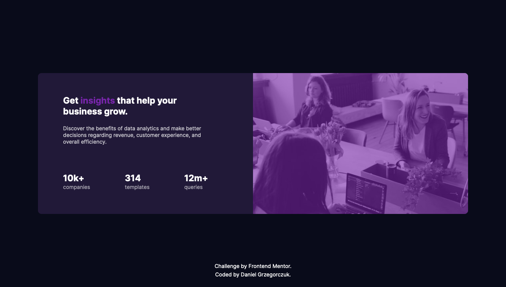

# Frontend Mentor - Stats preview card component solution

This is a solution to the [Stats preview card component challenge on Frontend Mentor](https://www.frontendmentor.io/challenges/stats-preview-card-component-8JqbgoU62).

## Table of contents

- [Overview](#overview)
  - [The challenge](#the-challenge)
  - [Screenshot](#screenshot)
  - [Links](#links)
- [My process](#my-process)
  - [Built with](#built-with)
  - [What I learned](#what-i-learned)
  - [Continued development](#continued-development)
  - [Useful resources](#useful-resources)
- [Author](#author)

## Overview

This is my first challenge from Frontend Mentor.
Overall I'm very happy with the result and I look forward to the future projects.

### The challenge

Users should be able to:

- View the optimal layout depending on their device's screen size

### Screenshot

### Links

- Solution URL: [LINK](https://danielczuk.github.io/stat-preview-card-component/)

## My process

I started with creating semantic HTML file and naming each element I would later use.
In CSS, before anything else I set universal box sizing to border box for a predictible styling. Then I structured my page using Flexbox.
When structure of a page started to look similar to the design I took care of every other element. The biggest challenge for me was the background-image as it was causing me many problems. I colored the image using :after element and setting background-color to transparent.
I also wondered whether inserting background url into fundamental code was a good idea, so I decided to put mobile verion into 320px media query and desktop version into 1025px and wider. This solution caused page to load only one image depending on width instead of both of them in case of a desktop view.

### Built with

- Semantic HTML5 markup
- Flexbox
- Mobile-first workflow

### What I learned

This was my first project and I learned a lot from it as for the first time I implemented all of the basics I've learned.
I practiced flexbox on a real life alike design and as a result I feel very confident with this technology now.
Also I made this page with mobile-first workflow and this taught me using media queries and best practices regarding them.
I set myself a time frame of 5 hours and I made it punctually. Furthermore, I'm confident I would code similar pages much faster now as I've covered all of the basics and fundumentals in this project.
I kept in mind not to repeat myself and to structure my CSS well.

### Continued development

After working with Flexbox I am now looking forward to structure page using Grid technology. Obviously my next project will me more complicated and primarly, more demanding.
I also want to work on img elements now, not only background-images.

### Useful resources

- [Css Tricks A - Complete Guide to Flexbox](https://css-tricks.com/snippets/css/a-guide-to-flexbox/) - I've been using this guide for the whole process as this is in my opinion the most reliable source on how to use Flexbox.

## Author

- Git - [@danielczuk](https://github.com/danielczuk)
- Frontend Mentor - [@danielczuk](https://www.frontendmentor.io/profile/danielczuk)
